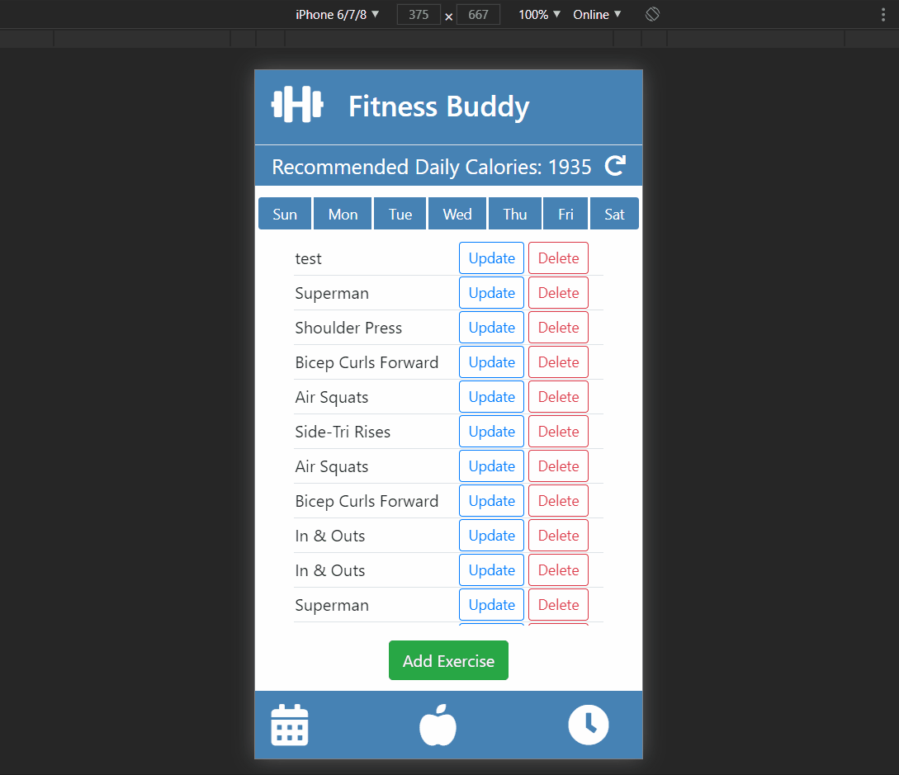

# Fitness Buddy
A full stack fitness tracking app.

## Live Demo
Try the app live at: [https://fb.mansoralmossa.com/](https://fb.mansoralmossa.com)

## Technologies Used
* HTML5
* CSS3
* Bootstrap 4
* React.js
* Node.js
* Express
* PostgreSQL
* AWS EC2

## Features
* User can view exercises
* User can add exercise
* User can update or delete exercise
* User can check the calories by entering some informations 

## Preview


## Development

### System Requirements
* Node.js 10 or higher
* Npm 6 or higher
* PostgreSQL

### Getting Started
1. Clone the repository : 
      ``` 
      git clone https://github.com/malmossa/watch-store.git 
      ```     
2. Install npm dependencies : 
      ``` 
      npm install 
      ```
3. Start PostgreSQL : 
      ``` 
      sudo service postgresql start 
      ```  
4. Import the database to PostgreSQL : 
      ``` 
      npm run db:import
      ```
5. Start the server : 
      ``` 
      npm run dev
      ``` 
6. Visit http://localhost:3000 in your browser to view the application
